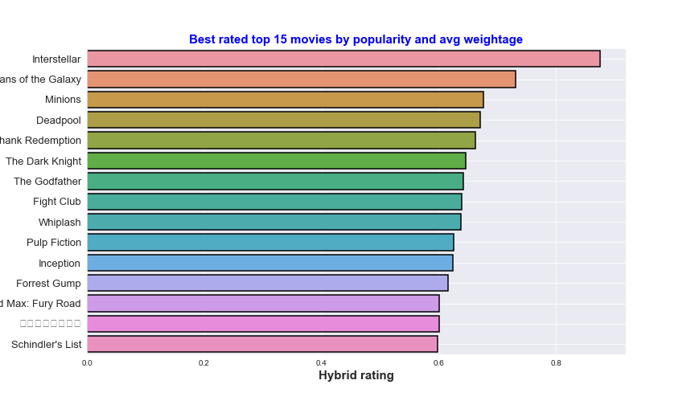

# Hybrid Weighted average rating
This is the basic recommender system, which recommend movies based on their rating and popularity. 

## About Data
Link to Data : https://www.kaggle.com/tmdb/tmdb-movie-metadata 

There are 2 csv files, i.e tmdb_5000_movies and tmdb_5000_credits. tmdb_5000_movies contains the data of movies, i.e movie id, genres, budget, revenue, runtime etc and tmdb_5000_credits contains the data such as cast, crew etc.

I used vote_average, vote_count and popularity to suggest top 15 movies.

## How I ranked Movies
We are provided with vote_average, vote_count and popularity of movies. So, I used only these three factors to recommend movies.

### * Step 1:
I calculated the weighted average as:

where:

*W*  = weighted rating

*R*  = average for the movie as a number from 1 to 10 (mean) (Rating)

*v*  = number of votes for the movie (votes)

*m*  = minimum votes required to be in top list

*C*  = the mean vote across the whole report

### * Step 2:
Calculated the movie score by giving 60% weightage to weighted rating and 40% weightage to popularity of movie.

Why 60:40 ratio?
* Because latest film are more popular than good old films. Therefore giving equal weitage to both the factor is not fair. So 60% weightage is given to weighted rating and 40% to popularity.

##### Thanks you!!
